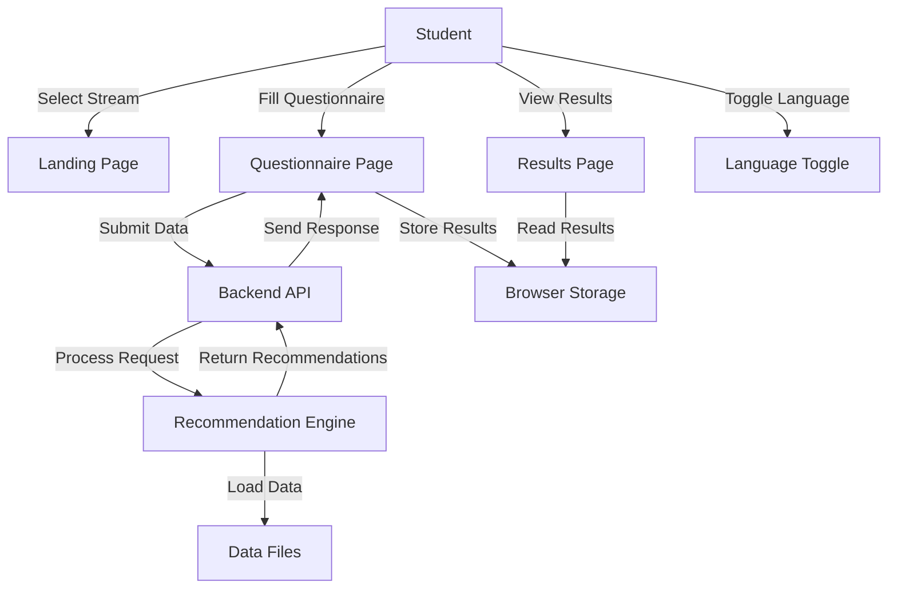
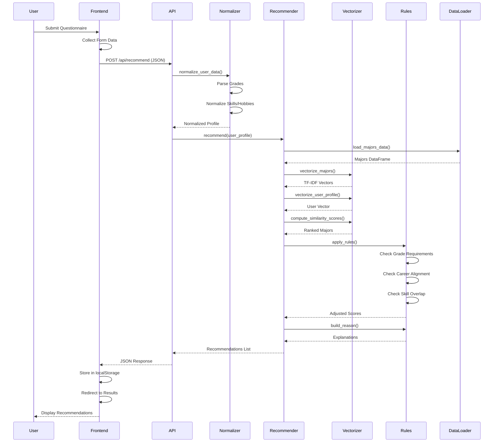

# Chapter 3: System Analysis & Design

## 3.1 Introduction

The MajorMatch system is a university major recommendation platform designed to assist Omani high school students in selecting appropriate university majors based on their academic performance, skills, interests, and career aspirations. The system addresses a critical decision point in students' educational journeys by providing data-driven, personalized recommendations that consider both semantic similarity and domain-specific academic requirements.

This chapter presents a comprehensive analysis of the system's requirements, stakeholder needs, architectural design, and modeling approaches. The analysis is grounded in the current implementation, which employs a hybrid recommendation approach combining TF-IDF vectorization for semantic matching with rule-based adjustments to refine recommendations according to academic constraints.

## 3.2 Requirements Analysis & Specification

### Functional Requirements

**FR1: Stream-Based Questionnaire Collection**
The system shall provide separate questionnaire interfaces for Science Stream and Literary Stream students, collecting stream-appropriate academic performance data including subject-specific grades and overall percentage.

**FR2: User Profile Data Collection**
The system shall collect and normalize user data including:
- Academic grades for relevant subjects
- Overall academic percentage
- Selected skills from a predefined list
- Custom skills entered by the user
- Selected hobbies from a predefined list
- Custom hobbies entered by the user
- Career aspiration text input

**FR3: Recommendation Generation**
The system shall generate personalized major recommendations by:
- Computing semantic similarity between user profile and major descriptions using TF-IDF vectorization
- Applying rule-based adjustments based on academic requirements, career alignment, and skill overlap
- Ranking majors by adjusted similarity scores
- Returning the top recommendation and up to three alternatives

**FR4: Recommendation Explanation**
The system shall provide human-readable explanations for each recommendation, including:
- Number of matched skills with the major's curriculum
- Career aspiration alignment indicators
- Key required subjects for the major
- General similarity rationale when specific matches are not found

**FR5: Language Support**
The system shall support bilingual operation (English and Arabic) with:
- Language toggle on all pages
- Automatic text direction switching (LTR for English, RTL for Arabic)
- Persistent language preference across pages using browser storage

**FR6: Results Display**
The system shall display recommendations in a structured format showing:
- Top recommendation with highlighted styling
- Alternative recommendations with match scores
- Explanatory reasons for each recommendation
- Option to retake the questionnaire

### Non-Functional Requirements

**NFR1: Performance**
The system shall respond to recommendation requests within 3 seconds under normal load conditions, with typical response times under 100 milliseconds for cached resources.

**NFR2: Usability**
The system shall provide an intuitive user interface that requires no training, with clear labels, logical flow, and responsive design that works on desktop and mobile devices.

**NFR3: Privacy**
The system shall operate in a stateless manner, not persisting any user data between sessions. All processing shall occur in-memory without database storage of personal information.

**NFR4: Maintainability**
The system shall be structured as a modular Python package with clear separation of concerns, allowing easy updates to major data, rule weights, and normalization logic without affecting other components.

**NFR5: Accuracy**
Recommendations shall be based on validated academic requirements and shall not suggest majors where the user's grades fall significantly below minimum requirements without appropriate penalty adjustments.

**NFR6: Accessibility**
The system shall support right-to-left text direction for Arabic users and ensure all interactive elements are accessible via keyboard navigation and screen readers.

## 3.3 User & Stakeholder Analysis

### Primary Users

**Science Stream Student**
Ahmed is a high school student in the Science Stream with strong performance in mathematics (95%) and physics (92%), but moderate performance in chemistry (78%). He enjoys coding, problem-solving, and has expressed interest in becoming a software engineer. Ahmed uses the system to explore computer science and engineering majors. The system should recognize his strong technical skills and career alignment, while considering his chemistry grade when evaluating chemistry-intensive majors.

**Literary Stream Student**
Fatima is a Literary Stream student with excellent performance in Arabic (98%) and English (95%), strong social studies (90%), and moderate mathematics (75%). She has interests in communication, leadership, and volunteering. Fatima aspires to work in public relations or education. The system should identify majors in humanities, social sciences, or education that align with her linguistic strengths and career goals, while accounting for her lower mathematics performance in quantitative fields.

**Edge Case Student**
Omar has mixed academic performance with no clearly dominant strengths. His grades range from 70% to 85% across subjects, and he has not specified a clear career aspiration. His skills and hobbies are diverse but not strongly aligned with any particular domain. The system should still provide reasonable recommendations based on overall similarity, with explanations that acknowledge the moderate match strength.

### Stakeholders

**Students**: Primary beneficiaries seeking guidance in major selection. Require accurate, understandable recommendations.

**High School Counselors**: May use the system to support student advising. Require transparency in recommendation logic.

**University Admissions Offices**: Indirect stakeholders who benefit from better-matched applicants. Require system to reflect actual admission requirements accurately.

**System Administrators**: Responsible for maintaining major data and system updates. Require clear data structure and update procedures.

## 3.4 System Architecture

### Current Architecture

The system follows a three-tier architecture:

**Presentation Layer (Frontend)**
- Static HTML pages with JavaScript for form handling and API communication
- Translation system for bilingual support
- Client-side data collection and validation
- Results rendering from API responses

**Application Layer (Backend)**
- Flask REST API server
- Request validation and error handling
- Integration with recommendation engine
- JSON response formatting

**Business Logic Layer (major_matcher package)**
- Data loading and normalization
- TF-IDF vectorization and similarity computation
- Rule-based score adjustments
- Recommendation explanation generation

**Data Layer**
- File-based storage (JSON for majors, text for context)
- In-memory caching of processed data
- No persistent database

### Data Flow

1. User submits questionnaire via frontend
2. Frontend sends JSON payload to Flask API
3. API normalizes user data
4. Recommendation engine:
   - Loads and caches major data (if first request)
   - Vectorizes user profile
   - Computes cosine similarity scores
   - Applies rule-based adjustments
   - Generates explanations
5. API returns formatted recommendations
6. Frontend displays results

### Future Architecture Improvements

**Database Integration**
The current file-based approach could be replaced with a relational database (e.g., PostgreSQL) to support:
- Dynamic major data updates without code deployment
- User session history (with consent)
- Feedback collection for system improvement
- Analytics on recommendation patterns

**Authentication & User Management**
Addition of user accounts would enable:
- Recommendation history tracking
- Saved profiles for comparison
- Personalized recommendations based on past interactions
- Feedback collection linked to user profiles

**Model Upgrades**
While TF-IDF provides transparency and speed, future enhancements could include:
- Pre-trained word embeddings (Word2Vec, GloVe) for better semantic understanding
- Fine-tuned transformer models (BERT-based) for context-aware matching
- Hybrid approaches combining TF-IDF with neural embeddings

**Deployment Scaling**
Current single-server design could be enhanced with:
- Load balancing for multiple backend instances
- CDN for static frontend assets
- Caching layer (Redis) for frequently accessed data
- Microservices architecture for independent scaling of components

**API Enhancements**
- GraphQL API for flexible data queries
- WebSocket support for real-time updates
- Batch recommendation processing
- Recommendation comparison endpoints

## 3.5 Use Case Modeling

### Use Case Diagram

### Use Case Descriptions

**UC1: Complete Science Stream Questionnaire**
- **Actor**: Science Stream Student
- **Preconditions**: Backend server is running
- **Main Flow**:
  1. Student accesses landing page
  2. Student selects "Science Stream"
  3. Student enters grades for mathematics, english, physics, chemistry, biology, and other subjects
  4. Student selects skills and hobbies
  5. Student enters career aspiration
  6. Student submits form
  7. System validates required fields
  8. System sends data to backend API
  9. System receives recommendations
  10. System redirects to results page
- **Postconditions**: Recommendations displayed, stored in browser storage

**UC2: Complete Literary Stream Questionnaire**
- **Actor**: Literary Stream Student
- **Preconditions**: Backend server is running
- **Main Flow**: Similar to UC1, but with literary stream-specific subjects (Arabic required, no physics/chemistry/biology)
- **Postconditions**: Recommendations displayed

**UC3: Switch Language**
- **Actor**: Any User
- **Preconditions**: User is on any page
- **Main Flow**:
  1. User clicks language toggle
  2. System switches language (EN ↔ AR)
  3. System updates all UI text
  4. System switches text direction (LTR ↔ RTL)
  5. System saves preference to browser storage
- **Postconditions**: All text translated, direction updated, preference saved

**UC4: View Recommendations**
- **Actor**: Student who completed questionnaire
- **Preconditions**: Recommendations exist in browser storage
- **Main Flow**:
  1. Student navigates to results page
  2. System reads recommendations from storage
  3. System displays top recommendation with explanation
  4. System displays alternative recommendations with scores
- **Postconditions**: Recommendations visible to student

## 3.6 Sequence Diagrams

### Sequence Diagram: Recommendation Request

### Sequence Description

1. **User Interaction**: Student completes questionnaire and submits form
2. **Data Collection**: Frontend JavaScript collects all form fields into structured JSON
3. **API Request**: POST request sent to Flask backend with user data
4. **Normalization**: User data is cleaned, parsed, and normalized (grades, skills, hobbies)
5. **Data Loading**: Major data loaded from JSON file (cached on subsequent requests)
6. **Vectorization**: Majors and user profile converted to TF-IDF vectors
7. **Similarity Computation**: Cosine similarity calculated between user and all majors
8. **Ranking**: Majors sorted by similarity score
9. **Rule Application**: Top candidates adjusted based on academic requirements and domain rules
10. **Explanation Generation**: Human-readable reasons generated for each recommendation
11. **Response**: JSON response sent to frontend
12. **Storage**: Results saved to browser localStorage
13. **Display**: Results page renders recommendations with explanations

## 3.7 Detailed Design & Technology Stack

### Technology Stack

| Component | Technology | Version/Notes | Rationale |
|-----------|-----------|---------------|-----------|
| **Backend Framework** | Flask | 2.x+ | Lightweight, Python-native, easy API development |
| **Data Processing** | pandas | Latest | Efficient DataFrame operations for major data |
| **Vectorization** | scikit-learn | Latest | TF-IDF vectorization and cosine similarity |
| **Frontend** | HTML5, CSS3, JavaScript (ES6+) | Native | No framework dependencies, fast loading |
| **Language Support** | Custom JavaScript | - | Dictionary-based translation system |
| **Data Format** | JSON | - | Human-readable, easy to update major data |
| **Text Processing** | Python regex, string ops | Standard library | Lightweight text cleaning and normalization |
| **Caching** | Python functools.lru_cache | Standard library | In-memory caching of expensive operations |
| **CORS** | flask-cors | Latest | Enable cross-origin requests for development |

### Design Patterns

**Singleton Pattern (Caching)**
The `@lru_cache` decorator ensures major data and TF-IDF vectors are loaded and computed only once, shared across all requests.

**Strategy Pattern (Rules)**
Rule-based adjustments are implemented as separate logical blocks that can be enabled/disabled or reordered without affecting other rules.

**Template Method Pattern (Normalization)**
The normalization pipeline follows a consistent structure: parse → clean → validate → format, with stream-specific variations.

**Facade Pattern (Recommender)**
The `recommend()` function provides a simple interface that hides the complexity of vectorization, similarity computation, and rule application.

### Module Responsibilities

**major_matcher.config**
- Centralized configuration constants
- File paths and thresholds
- Rule weights

**major_matcher.data_loader**
- JSON parsing and validation
- Context file parsing
- DataFrame construction and normalization

**major_matcher.user_profile**
- Form data parsing
- Grade extraction and validation
- Skills/hobbies normalization
- Career text cleaning

**major_matcher.similarity**
- TF-IDF vectorizer initialization
- Major corpus vectorization
- User profile vectorization
- Cosine similarity computation

**major_matcher.rules**
- Grade requirement checking
- Career alignment scoring
- Skill overlap detection
- Score adjustment application
- Explanation generation

**major_matcher.recommender**
- Orchestration of recommendation pipeline
- Result formatting
- Top-K selection

**backend.app**
- HTTP request handling
- Error handling and validation
- Response formatting
- CORS configuration

## 3.8 Project Management Methodology

### Development Approach

The project follows an **iterative, Agile-inspired** development methodology with emphasis on:
- Incremental feature development
- Regular testing and validation
- User feedback incorporation
- Continuous refinement of recommendation logic

### Timeline

**Phase 1: Foundation (Months 1-2)**
- Data collection and structuring (majors.json, context.txt)
- Core recommendation algorithm implementation
- Basic Flask API development

**Phase 2: Frontend Development (Months 3-4)**
- HTML questionnaire pages
- Form validation and submission
- Results display implementation

**Phase 3: Refinement (Months 5-7)**
- Rule-based adjustments implementation
- Explanation generation
- Testing and validation with sample users

**Phase 4: Enhancement (Months 8-9)**
- Language support (bilingual interface)
- RTL layout implementation
- UI/UX improvements

**Phase 5: Testing & Documentation (Months 10-11)**
- Comprehensive testing (unit, integration, user scenarios)
- Documentation completion
- Performance optimization
- Final validation

### Team Structure

**Team Size**: 4 members

**Roles**:
1. **Backend Developer**: Flask API, recommendation engine, data processing
2. **Frontend Developer**: HTML/CSS/JavaScript, UI/UX, language support
3. **Data Analyst**: Major data collection, normalization, validation
4. **Project Manager/QA**: Testing, documentation, coordination, user validation

### Deliverables

- Functional recommendation system
- Bilingual user interface
- Technical documentation
- User testing reports
- Deployment guide
- Maintenance documentation

